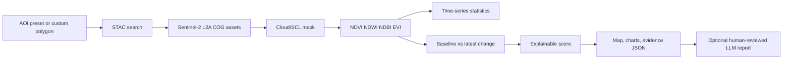

# Architecture and scope decision

## Product

**UAE Urban Resilience & Green Infrastructure Monitor** is a bounded evidence tool. It finds Sentinel-2 observations for a selected UAE urban cluster, calculates physically interpretable indices, compares the latest acquisition with a temporal baseline, and ranks unusual change locations for review.

## Data flow

## Why not begin with an LLM or a large deep-learning model?

The scientific value is in getting the observation chain right: acquisition selection, cloud screening, CRS handling, scale factors, temporal baselines, and limitations. An LLM can summarize evidence, but it cannot repair weak labels or turn a spectral proxy into ground truth. A TorchGeo foundation model becomes meaningful only after the project has a task, labels, splits, and a baseline.

## Decision records

| Decision | Rationale |
|---|---|
| STAC + COG access | Interoperable and current; keeps the notebook free of manual downloads. |
| Planetary Computer first | Public anonymous STAC and convenient signed assets; CDSE remains a documented alternative. |
| Urban-cluster presets | UAE-wide imagery is unnecessarily heavy for a first demo and crosses multiple UTM zones. |
| 20 m analysis grid | Consistent resolution for red-edge-adjacent indices and lower Colab memory use. |
| SCL masking | Reduces obvious cloud, shadow, cirrus, and snow contamination; still not a substitute for validation. |
| Explainable score | Recruiters can inspect the formula and reason codes rather than trusting a black box. |
| Optional IsolationForest | Shows applied ML while clearly labeling it exploratory and unsupervised. |
| LLM-ready evidence JSON | Adds modern AI engineering without letting an LLM make scientific or operational decisions. |

## Success criteria

- A fresh Colab runtime can install dependencies and run the notebook.
- A user can change AOI, date range, cloud threshold, index, and change threshold.
- The output includes imagery IDs, acquisition dates, cloud cover, CRS, index definitions, and limitations.
- A recruiter can see a map, time series, an interpretable anomaly ranking, and a clear extension path.
- No unsupported claim is presented as a measurement.
